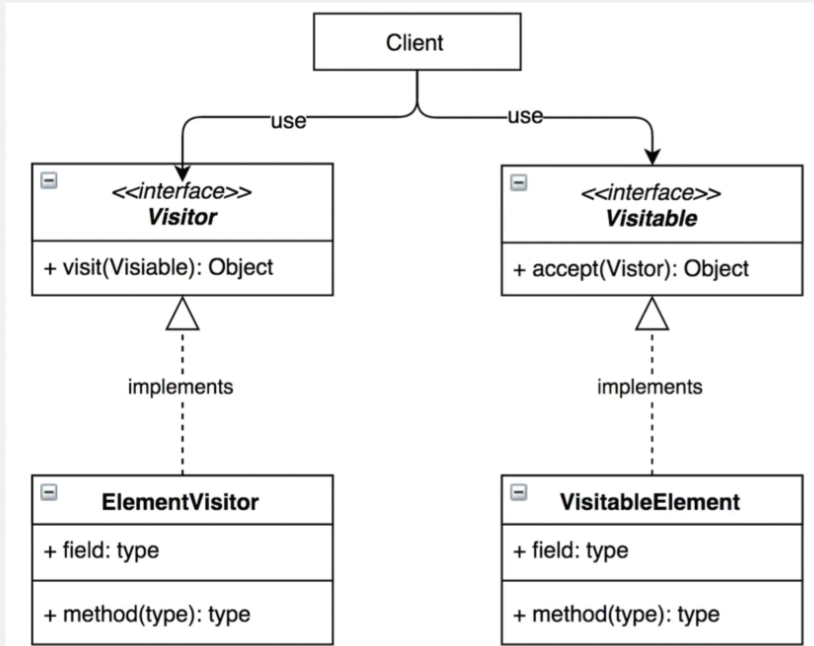

### Visitor Pattern
객체에서 처리를 분리한다.

- Visitor: 로직을 가지는 객체
- Visitable: 로직을 적용할 객체

---
- 구조를 수정하지 않고도 새로운 동작을 기존 구조에 추가할 수 있다.
- 예제에서 `VisitorA`는 `Visitable`의 `age`를 더한다. 만약 `age`를 곱하고 싶다면 그 로직을 갖는 `VisitorB`를 추가하면 된다. `Visitable`은 바뀌지 않는다!  
  반대로, 만약 `height`을 더하고 싶다면 그 구조를 갖는 `VisitableB`를 추가하면 된다.